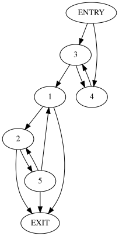
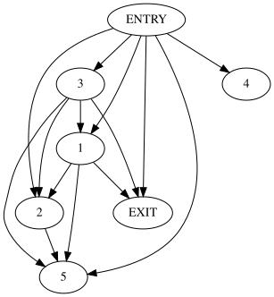

# Compiler course YADRO

## Download & build
```bash
git clone https://github.com/Maksim-Sebelev/compiler-course-hw CCY &&
cd CCY &&
cmake -S . -B build -DCMAKE_BUILD_TYPE=Release &&
cmake --build build
````

## What is going on

## Generate random graph
Run
```bash
./build/generate-graph-test
```
this tool generates random graph (with kind of *good* random settings) and print it in ./build/generate-graph-test.svg


## Dominators graph
Run
```bash
./build/dominators-graph
```
this tool generates random graph (./build/original-graph.svg) and its dominators graph (./build/dominators-graph.svg)


## How it should look
if all is ok, graph and its dominators graph will look like:



